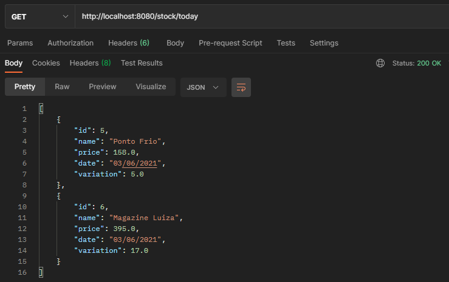

<p align="center">
  
</p>

<p align="center">
  <a href="#about">About</a>&nbsp;&nbsp;&nbsp;|&nbsp;&nbsp;&nbsp;
  <a href="#preview">Preview</a>&nbsp;&nbsp;&nbsp;|&nbsp;&nbsp;&nbsp;
  <a href="#technologies">Technologies</a>&nbsp;&nbsp;&nbsp;|&nbsp;&nbsp;&nbsp;
  <a href="#building">Building</a>&nbsp;&nbsp;&nbsp;|&nbsp;&nbsp;&nbsp;
  <a href="#contributing">Contributing</a>&nbsp;&nbsp;&nbsp;
</p>

## About
<strong>Stock Quote</strong> is a platform for daily monitoring of stock variations available on the market.


## Preview

#### Swagger
```
http://localhost:8080/swagger-ui.html
```
<p align="center">
  
</p>

#### Stock Methods
```
GET: http://localhost:8080/stock
```
<p align="center">
  
</p>

```
PUT: http://localhost:8080/stock
```
<p align="center">
  
</p>

```
POST: http://localhost:8080/stock
```
<p align="center">
  
</p>

```
GET: http://localhost:8080/stock/{id}
```
<p align="center">
  
</p>

```
DELETE: http://localhost:8080/stock/{id}
```
<p align="center">
  
</p>

```
GET: http://localhost:8080/stock/today
```
<p align="center">
  
</p>


## Technologies
This project was developed using the following technologies:
- [Spring](https://spring.io/)
- [Java](https://www.oracle.com/br/java/technologies/javase-jdk11-downloads.html)
- [JPA + Hibernate](https://spring.io/projects/spring-data-jpa)
- [Postgres](https://www.postgresql.org/)


## Building
You'll need [Java 11+](https://www.oracle.com/br/java/technologies/javase-jdk11-downloads.html) and [Maven](https://maven.apache.org/download.cgi) installed on your computer in order to build this app.
```bash
$ git clone https://github.com/eric-souzams/stock-quote-api.git
$ cd /stock-quote-api
$ mvn spring-boot:run
```


## Contributing

This repository is currently under development. If you want to contribute please fork the repository and get your hands dirty, and make the changes as you'd like and submit the Pull request.